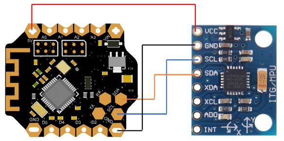
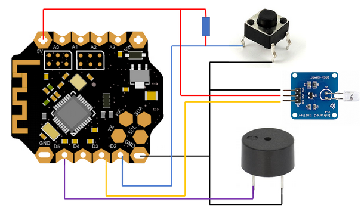
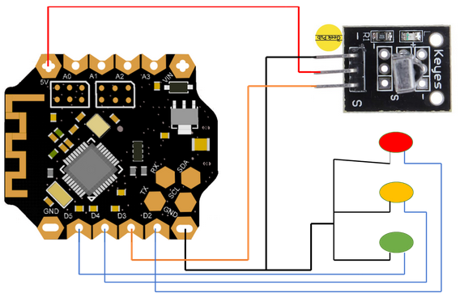

# Hardware Sensors
This folder contains codes for the Hardware Sensors.

# Pre-requisites
## IR Reciever/Transmitter library
The project uses KY022 and KY005 IR modules. The Arduino driver for the modules can be found [here](https://github.com/Arduino-IRremote/Arduino-IRremote)

## I2C Library
I2C protocol is used for communication between Beetle and MPU6050. The driver library can be found [here](https://github.com/arduino/ArduinoCore-avr/tree/master/libraries/Wire)

# (Not the best) Schematic for players' gear
## Gloves

## Guns

## Vests

# Files description
## Player 1's Gear
[player_1_gun_ble](player_1_gun_ble) folder contains Arduino code for the player 1's gun.
[player_1_vest_ble](player_1_vest_ble) folder contains Arduino code for the player 1's vest

## Player 2's Gear
[player_2_gun_ble](player_2_gun_ble) folder contains Arduino code for the player 2's gun.
[player_2_vest_ble](player_2_vest_ble) folder contains Arduino code for the player 2's vest

## Common Gear
[gloves](gloves) folder contains Arduino code for both player 1 and player 2 gloves.
